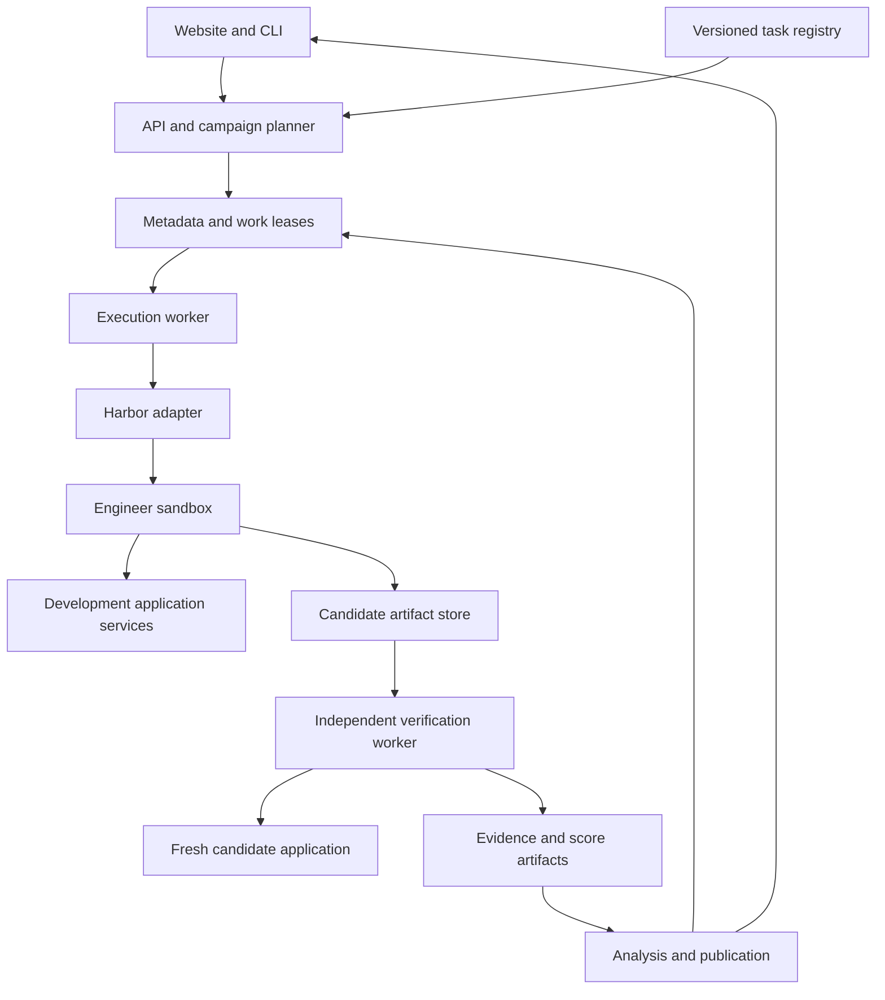
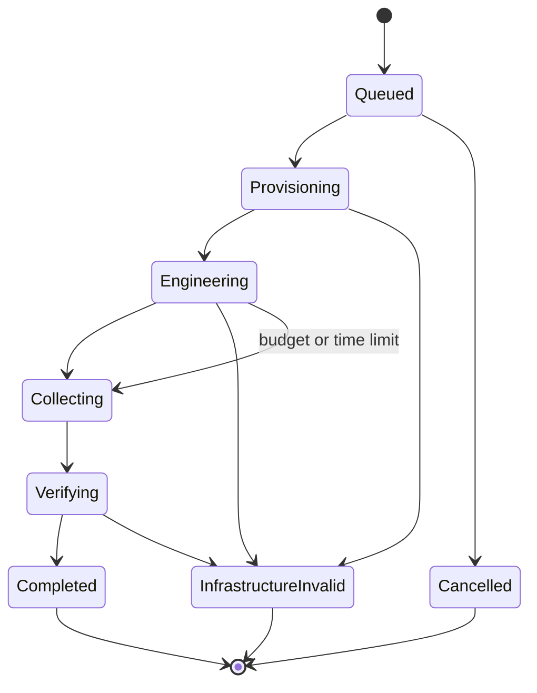

# AI Engineer Bench — Product and System Architecture

Version: 0.1 · 13 September 2026 · Status: proposed implementation baseline

This document specifies the product to build. Interfaces and CLI examples prefixed `aieb` are proposed, not implemented. Harbor is the selected execution dependency; integration must be validated against a pinned release before implementation. This is an architecture specification, not a claim of benchmark novelty or completed validation.

## 1. Product definition

AI Engineer Bench evaluates whether coding agents can resolve practical engineering tickets in runnable AI applications. It supplies versioned repositories, application services, data, requirements, budgets, and independent evaluators. It publishes reproducible results and evidence through a CLI and comparison website.

Primary outcome: a requested engineering change works on held-out cases, preserves required existing behavior, and satisfies explicit constraints.

The product consists of (1) an open task specification and development suite, (2) an execution and verification package, (3) centrally administered benchmark campaigns, and (4) a public results explorer. A platform for customers to run arbitrary private repositories is a later product, not a launch dependency.

## 2. Evaluation subject and tracks

Two distinct systems exist in every task:

- Engineer agent: the contestant editing code and running commands.
- Application under test: the RAG, extraction, or tool-using application the contestant modifies.

The engineer model and application model are independent configuration fields. Freeze application dependencies across contestants unless a ticket explicitly permits their modification. Keep their usage in separate ledgers.

| Track | Controlled | Variable | Interpretation |
| --- | --- | --- | --- |
| Agent systems | Task revision, application dependencies, environment class, limits, evaluator | Complete coding-agent configuration | Performance of the tested agent system |
| Models | Above plus one fixed reference coding-agent implementation, prompt, tools and context policy | Engineer model | Model performance under the disclosed reference setup |

Do not merge these tracks into one ranking. Vendor-default settings and standardized settings are separate profiles. Unsupported controls are recorded, not silently approximated. Additional models/subagents used by an entrant are disclosed and charged to its engineer ledger.

## 3. Users and product flows

| User | Primary flow | Deliverable |
| --- | --- | --- |
| Reader | Select suite release and track; compare entrants | Results with uncertainty and evidence |
| Agent developer | Run public tasks locally; inspect errors; submit a configuration | Local report and optional official evaluation request |
| Task contributor | Author task; validate reference and counterexamples; submit for review | Admitted, versioned task |
| Maintainer | Freeze a release; schedule campaign; review invalid runs; publish | Audited results snapshot |

Public pages: overview, task catalog, task detail, entrant profile, comparison, run evidence, methodology, release history, corrections. Admin pages: campaign progress, infrastructure exceptions, task admission, publication review. A reader needs no account. Maintainer and submission actions require authentication. Phase one accepts submissions manually; arbitrary public execution is disabled.

## 4. Scope and non-goals

v0.1: diagnosis and repair; Python backends; CPU task environments; RAG/search, structured extraction, and tool-using applications; no GUI interaction required. Build three complete vertical tasks before expanding to twelve.

Later: feature implementation, provider/embedding migrations, quality improvements, performance optimization, model serving and AI infrastructure.

Not v0.1: broad pretraining research, Kubernetes administration, GPU kernels, subjective front-end design, production customer data, arbitrary outbound internet, autonomous benchmark generation without review, or a single universal AI-engineer score.

## 5. Architecture decisions

| ID | Decision | Reason and cost |
| --- | --- | --- |
| ADR-01 | Use Harbor through a thin adapter and pin its version | Reuse task execution and agent integrations; adapter compatibility tests required |
| ADR-02 | Build a modular Python application, not microservices | Small team can operate it; scale worker pools separately |
| ADR-03 | Separate engineering, candidate application, and verifier trust domains | Candidate changes cannot redefine success; more environment provisioning |
| ADR-04 | Immutable task, entrant, evaluator, and campaign revisions | Auditable comparisons; corrections create new records |
| ADR-05 | Start with public development cases and private official evaluation data | Local reproducibility plus stronger official evaluation; hidden tests remain an ongoing maintenance cost |
| ADR-06 | Replay candidate artifacts into a clean evaluation environment | Excludes undeclared workspace state and lingering agent processes |
| ADR-07 | Measure application behavior with fixtures and live models in distinct modes | Determinism alone cannot demonstrate end-to-end generative quality |
| ADR-08 | Use PostgreSQL for hosted metadata, object storage for artifacts | Queryable records and inexpensive large files; CLI remains local-first |
| ADR-09 | Use polling workers with PostgreSQL leases initially | Avoid duplicate queue infrastructure; reconsider at measured throughput limits |
| ADR-10 | Official results require centrally executed or independently reproduced runs | Self-reported results have a separate provenance label |

## 6. System topology



The arrows express logical ownership and data flow, not unrestricted network access. Engineer sandbox cannot reach metadata, verifier, official data, object-store credentials, or the container host. Candidate application never receives evaluator answer keys. Workers provision services through host-side control, without exposing a Docker socket to the contestant.

## 7. Modules and implementation stack

| Module | Responsibility | Initial implementation |
| --- | --- | --- |
| contracts | Task, entrant, campaign, event, verdict schemas | Python + Pydantic; versioned JSON schemas |
| registry | Resolve immutable releases and content hashes | Git manifests and OCI image digests |
| planner | Expand campaigns, validate comparability, estimate upper bounds | Python library shared by CLI/API |
| execution | Harbor translation, lifecycle, artifact extraction | Python worker; subprocess/SDK behind adapter |
| environments | Fixtures, service provisioning, reset and isolation checks | Container images; local Compose; isolated VM workers for official runs |
| verification | Fresh replay, hidden workloads, invariant checks | Pytest and application-specific checkers |
| accounting | Engineer/application/verifier usage attribution | Broker request ledger + disclosed adapter usage |
| analysis | Aggregation, intervals, comparisons, report generation | Python numerical/statistical libraries |
| api | Read results and administer campaigns | FastAPI, PostgreSQL, SQLAlchemy/Alembic |
| web | Catalog, tables, evidence, methodology | React + TypeScript; generated API types |
| storage | Content-addressed uploads and redacted exports | S3-compatible object storage; filesystem implementation locally |

Do not require a hosted API for local runs. Local CLI writes manifests, JSONL events, JSON scores, and HTML reports to a run directory. The hosted ingestion path consumes the same validated schemas.

## 8. Repository layout

| Path | Content |
| --- | --- |
| packages/aieb-core/ | Contracts, planning, task registry, scoring primitives |
| packages/aieb-runner/ | Harbor adapter, worker lifecycle, environment controls |
| packages/aieb-evaluators/ | Public evaluator utilities and development checks |
| packages/aieb-cli/ | Commands, local reports |
| services/api/ | Hosted API and database migrations |
| apps/web/ | Public and admin UI |
| suites/dev/ | Public tasks, visible data and reference solutions |
| manifests/releases/ | Frozen suite/campaign manifests |
| infrastructure/ | Images, worker provisioning, deployment configuration |
| tests/ | Contract, integration, replay and evaluator tests |
| docs/ | Methodology, contributor guide, decisions |

Private official test data, answer keys, and adjudication material live in a separate access-controlled repository/bucket, not a directory hidden inside a public image. Secrets do not enter either repository.

## 9. Formal objects

| Object | Contract |
| --- | --- |
| Task revision | Ticket + repo commit + application fixture + edit policy + contract + evaluator revision |
| Task family | Shared underlying project/mechanism; determines grouping for splits and statistics |
| Entrant revision | Agent/model versions, settings, prompts, tools, permissions, declared providers |
| Experiment cell | Task revision × entrant revision × dependency mode × budget profile |
| Repetition | A prespecified independent execution of an experiment cell |
| Trial | Immutable identity for one repetition; may have infrastructure attempts |
| Attempt | A physical execution with unique artifacts; never overwritten by a retry |
| Candidate | Content-hashed source tree/patch plus allowed generated artifacts |
| Evaluation | Candidate + evaluator revision + held-out fixture revision + workload schedule |
| Campaign | Prespecified set of trial cells, repetitions, ordering, statistical and exclusion rules |
| Publication | Immutable approved results snapshot with included and excluded trial IDs |

Use a canonical serialized experiment-cell manifest hash for matching. Trial ID also includes repetition index. Physical attempt IDs are independent UUIDs. Repeating a trial intentionally requires an explicit new repetition, not a failed-work retry.

## 10. Task bundle contract

Public task package contains `instruction.md`, repository source snapshot, development tests/data, environment files, and an AIEB manifest. A generated Harbor package is an execution artifact, not the canonical scientific definition. Official evaluator material is attached only to the trusted verification process.

Illustrative AIEB YAML, not Harbor configuration:

```yaml
schema_version: aieb.task/v1
id: rag.document-freshness
version: 0.1.0
family_id: knowledge-service-a
category: rag
activity: repair
repository:
  source: bundled
  commit: <resolved-full-commit>
environment:
  image: <registry/image@sha256:digest>
  resource_profile: cpu-small-v1
  dependency_mode: fixture
application:
  entrypoint: [python, -m, knowledge_service]
  contract: contracts/application-v1.json
  model_profile: application-fixture-v1
submission:
  include: [src/**, config/**, pyproject.toml, uv.lock]
  protected: [dev_tests/**]
  max_artifact_bytes: 52428800
budget:
  engineer_wall_seconds: 1200
  verification_wall_seconds: 300
requirements:
  - id: latest-version-visible
    severity: mandatory
  - id: deleted-content-absent
    severity: mandatory
  - id: unchanged-documents-preserved
    severity: mandatory
  - id: incremental-update-contract
    severity: mandatory
evaluation:
  evaluator_id: rag-freshness/v1
  development_fixture: rag-freshness-dev/v1
  official_fixture_ref: restricted
```

All placeholders must resolve before running. Validators reject unknown schema versions, floating images, invalid glob policies, missing license declarations, and unresolved task dependencies. Task requirements and externally visible behavior are public; exact held-out examples are private. Hidden tests cannot introduce undisclosed requirements.

## 11. Runtime protocol

1. Validate and freeze campaign manifest, budgets, entrant configs, task/image digests, and evaluation plan.
2. Provision a fresh isolated worker allocation and application development services. Verify health and fixture hashes.
3. Start the engineer agent with ticket, allowed repository, development data, commands and provider access.
4. Record observable events and broker usage; enforce time, resource, and supported monetary limits.
5. Stop on submission or declared limit; terminate all contestant processes before collecting artifacts.
6. Extract only allowed regular files; reject escaping symlinks, oversized artifacts and protected-path modifications. Include new/untracked allowed files, not only Git diffs.
7. Build the candidate in an untrusted build sandbox with pinned approved dependencies. Host-side artifact hashing does not execute candidate code.
8. Launch a clean candidate application. Trusted verifier drives it through declared interfaces using fresh held-out cases.
9. Collect external operation logs, outputs, invariant evidence and usage. Candidate-reported metrics cannot determine reward.
10. Persist immutable verdict and manifest links, clean all environments, aggregate after campaign completion.

For repair tasks, the allowed source changes are replayed, not the engineer's database volumes or process state. Stateful migration tasks later need their own submission and replay contract.

## 12. State machine and retries



Execution status and scientific verdict are separate. Verdicts: PASS, FAIL, CONTRACT_VIOLATION, INDETERMINATE. Failure reasons include build error, application regression, semantic error and timeout. Setup/provider/verifier outages can produce infrastructure-invalid attempts under a published attribution rule. Application exceptions caused by the candidate are failures, not infrastructure exemptions.

At deadline, freeze and evaluate the partial candidate if feasible. The initial completion protocol allows any artifact present by the deadline; record `termination_reason=deadline` even if the artifact passes. No extra editing time is given during verification. Cancellation after execution starts cannot silently disappear from official campaign reporting; publication requires completing/replacing the prespecified cell or marking the campaign incomplete.

Infrastructure retries: maximum two replacement attempts initially, retaining all logs and costs. Never retry a scored engineering failure to improve its result. Agent-internal retries consume the trial budget. A host lease timeout makes a run suspect; recovery reconciles containers and artifacts before rescheduling, with fencing tokens preventing an old worker from finalizing a newer attempt.

## 13. Harbor integration boundary

Harbor owns installed-agent execution and environment lifecycle where its backend supports the task. AIEB owns campaign science, hidden verification, result provenance and publication. Do not deep-fork Harbor.

Proposed adapter methods:

```python
class ExecutionBackend(Protocol):
    async def preflight(self, spec: ResolvedTrial) -> CapabilityReport: ...
    async def launch(self, spec: ResolvedTrial) -> ExecutionHandle: ...
    async def status(self, handle: ExecutionHandle) -> ExecutionStatus: ...
    async def cancel(self, handle: ExecutionHandle) -> None: ...
    async def collect(self, handle: ExecutionHandle) -> CandidateArtifacts: ...
```

These methods belong to AIEB. Translate them to the pinned Harbor version. Do not assume lifecycle hooks intercept every tool call or provide complete streaming traces. Mark event coverage per entrant. Where Harbor's separate verifier mode meets our isolation/replay contract, use it; otherwise run the trusted AIEB verification worker after extraction. A separate verifier container by itself does not make candidate code trustworthy.

Required integration spike: one installed agent, one multi-service task, timeout collection, clean artifact replay, external verifier, and cost attribution. Pin a release only after this succeeds. If a required isolation feature is unavailable, change the execution backend implementation rather than weaken the evaluator boundary.

## 14. Application models and external dependencies

Fixture mode: deterministic local services provide controlled embeddings, model outputs, tool responses, and errors. Fixtures must cover variable inputs or reject unsupported calls explicitly; canned outputs alone cannot measure free-form quality. Label results integration correctness.

Live mode: freeze requested model version, provider, parameters, corpus and application settings; repeat application evaluations. Store requested and reported model identities and timestamps. Mutable provider aliases mean configuration reproducibility, not bitwise reproducibility. An application backend version change creates a new comparison cohort.

Engineer model calls use an authenticated budget broker where supported. Application model calls use another identity and budget. Verifier/judge calls use a third. No provider secret is embedded in a public task image. Hosted agents that cannot expose or route usage receive an accounting-coverage label and cannot enter a hard-dollar-budget track without enforceable controls.

Offline dependencies are prebuilt or sourced from a frozen package mirror. Standard track disables general web access; docs snapshots are available. A future web-enabled track has separate rules and rankings.

## 15. Evaluation design

Layer A: build/start and API contract. Layer B: requested behavior. Layer C: regression invariants. Layer D: task-specific constraints. Layer E: measured quality/performance where required.

A trial passes only if all mandatory predicates pass. Diagnostic partial credit is reported per requirement, not substituted for success. Protected evaluator reports are computed outside the candidate. Hashes of predictions, requests, patches and fixtures tie evidence to a verdict.

Structured extraction uses typed-field comparisons, normalization rules, units and missingness policies. Retrieval checks authoritative document IDs, versions, deletion behavior, ranking thresholds and citation provenance. Tool applications use an external state ledger, not the application's claim that an action succeeded.

For generative tasks, prefer reference-supported factual checks with known acceptable variants. LLM judges are secondary initially. If primary scoring requires a judge, validate agreement against independent human labels, freeze prompt/model/rubric, disclose uncertainty and provide adjudication. A model switch must not silently change historical scores.

Performance tasks need fixed hardware class, load, warmup, dataset and concurrency; evaluate baseline and candidate in randomized matched blocks. Wall-clock noise must not determine semantic scores. Quality non-inferiority thresholds and latency thresholds are declared before results are inspected.

## 16. Evaluator admission and resistance to shortcuts

Each task requires an intentionally broken baseline, a working reference solution, and at least one alternative valid implementation when feasible. Evaluators must reject task-specific counterexamples: hardcoded outputs, deleted functionality, skipped processing, swallowed exceptions, copied labels, output truncation, rewritten scoring, and forbidden full rebuilds.

Mutation checks are chosen from plausible shortcuts, not generated only to match evaluator code. Wrong answers must fail even if reported metrics claim success. Passing a reference implementation once is insufficient: execute repeated resets and held-out fixtures before admission.

Public tasks with reference solutions are development tasks. Official runs use separately administered data and, over time, unpublished task families. Public-origin tasks remain labeled public; hidden examples do not make them contamination-free. Never mix related task variants across development and official splits as though independent.

Task lifecycle: draft → reference validated → adversarial checks → independent review → pilot → release → deprecated/withdrawn. Keep licenses, origin links, adaptation notes, known limitations and contributor conflicts. No autonomous admission.

## 17. Initial task suite

| ID | Family | Ticket | Primary evidence |
| --- | --- | --- | --- |
| RAG-01 | Knowledge service A | Updated documents return stale content | Versioned retrieval across updates |
| RAG-02 | Search service B | Filters apply after top-k and suppress relevant matches | Held-out filter/ranking cases |
| RAG-03 | Knowledge service A | Citations point to the wrong chunk after reindexing | Citation-to-source mapping |
| RAG-04 | Search service B | Embedding change leaves an incompatible index | Migration/compatibility contract, no silent mixing |
| EXT-01 | Extraction service C | Missing fields become invented defaults | Missingness and typed-field accuracy |
| EXT-02 | Extraction service C | Batch outputs attach to wrong document IDs | Permuted inputs and stable correspondence |
| EXT-03 | Extraction service D | Unit normalization corrupts values | Exact normalized values and units |
| EXT-04 | Extraction service D | One malformed result drops successful batch items | Partial success and per-item errors |
| TOOL-01 | Workflow service E | Tool failure is reported as task completion | External operation ledger |
| TOOL-02 | Workflow service E | Retrying an ambiguous write duplicates an action | Exactly required application effects |
| TOOL-03 | Assistant service F | Session state leaks across conversations | Interleaved session isolation checks |
| TOOL-04 | Assistant service F | Application reuses stale tool arguments after correction | Corrected arguments and resulting state |

These are candidate task briefs, not existing released tasks. Six base projects prevent pretending that twelve variants are twelve independent application samples. First vertical slices: RAG-01, EXT-02, TOOL-01. Where a requirement is an integration contract, fixture mode suffices; genuinely semantic improvements require live-mode evidence.

## 18. Metrics and statistical protocol

For task t with n valid repetitions and s passes: p_hat_t = s/n. Suite resolution rate is the unweighted mean across the frozen task list, not a mean over every assertion. Publish category rates and task-level outcomes alongside any suite total. Task weights are frozen in the release.

Repeatability: publish per-task s/n and the fraction of tasks passed on all k planned valid trials, labeled by k. If reporting the pass^k estimator for n >= k, use choose(s,k)/choose(n,k), not pass@k (at least one success). Tiny n does not justify strong reliability claims.

Intervals: Wilson intervals for per-task binomial proportions with independence caveats. For suite comparisons, use paired resampling preserving task correspondence and group by underlying project when appropriate. With only six projects, cluster intervals are exploratory; report that limitation rather than implying population-wide certainty. Choose final campaign sample sizes after pilot variance and a prespecified minimum meaningful difference.

Cost per successful resolution: total measured engineer + development application expenditure across scored trials divided by successful resolutions. Report verification and infrastructure overhead separately, and publish full campaign spend including invalid attempts. Zero success produces undefined cost per success, never zero. Unknown usage stays unknown. Measured, estimated, and vendor-reported costs have distinct labels.

Latency: engineering time distribution, successful-run time, and deadline frequency. Application latency is a different metric. No p95 claims from five trials. No ranking by tool count: extra checks may be beneficial.

For live applications, freeze m evaluation repetitions and task acceptance rules before running. Distinguish repeated engineer attempts from repeated evaluations of a single candidate. Avoid treating their observations as independent engineering successes.

## 19. Budget and campaign planning

Initial illustrative profile: 20 minutes engineering; 5 minutes verification; CPU-small 2 vCPU/4 GiB for engineer and task-specific separate application resources; one trial per isolated allocation. These are starting limits to calibrate against reference solutions, not measured sufficiency claims.

Pilot: 3 tasks × 2 entrants × 3 engineer repetitions = 18 trials in fixture mode. Development campaign: 12 tasks × 3 entrants × 5 repetitions = 180 trials per dependency mode and budget profile. Additional modes multiply this count; show that expansion in CLI before launch.

Upper-bound reservation = planned trials × (engineer cap + development application cap + verifier cap + environment upper bound), with an explicit infrastructure replacement reserve. No fixed dollar estimate before measuring pilot usage and selecting provider prices.

Hard-dollar caps require reserving possible request spend before dispatch and accounting for in-flight calls. Unsupported providers cannot claim hard enforcement. Concurrency and rate-limit settings are frozen; interleave entrants across time blocks to reduce provider/time bias. Hardware oversubscription is prohibited for scored performance measurements.

## 20. Data model

| Table | Important fields and relations |
| --- | --- |
| suite_release | id, name, version, protocol_hash, status |
| task_revision | id, task_id, family_id, manifest_hash, source_hash, evaluator_revision_id |
| suite_task | suite_release_id, task_revision_id, ordinal, weight |
| entrant_revision | id, agent/model metadata, config_hash, accounting_coverage |
| campaign | id, suite_release_id, manifest_hash, track, state, budget_profile |
| trial | id, campaign_id, task_revision_id, entrant_revision_id, repetition, cell_hash |
| attempt | id, trial_id, attempt_number, lease_token, status, termination_reason |
| candidate | id, attempt_id, artifact_digest, file_manifest_digest |
| evaluation | id, candidate_id, evaluator_revision_id, fixture_revision, verdict, score_digest |
| usage_event | id, attempt_id/evaluation_id, actor_role, provider_request_id, token/cost fields |
| artifact | digest, storage_key, media_type, bytes, visibility, retention_class |
| publication | id, campaign_id, snapshot_digest, reviewer, published_at, supersedes |
| audit_event | actor, operation, target, timestamp, before/after revision |

Unique constraints: campaign/task/entrant/mode/profile/repetition; attempt/trial/attempt_number; provider/account/request identity for deduplicated usage. Object writes are immutable and verified by hash before transactional metadata finalization. An orphan cleanup job removes unreferenced temporary objects after a grace period.

## 21. Event and result contracts

Observable event envelope: schema_version, event_id, attempt_id, source, sequence, occurred_at, received_at, actor_role, event_type, payload, artifact_refs. Separate sources use independent sequence numbers; timestamps alone cannot prove global ordering.

Events include provisioning, command start/end where exposed, model usage, application request/result, external state change, submission, evaluator check, deadline and cleanup. No private chain-of-thought collection is required. Public traces contain observable commands/actions and sanitized outputs, not hidden reasoning.

Verdict envelope includes candidate/evaluator/fixture hashes, mandatory checks with status and evidence refs, diagnostic metrics, validity status, termination reason, usage coverage and timestamps. Schema validation occurs at worker completion and API ingestion.

Failure taxonomy describes observations: build_failure, contract_failure, retrieval_error, extraction_error, state_error, regression, constraint_violation, budget_exhausted, evaluator_error, infrastructure_error. Root causes such as context loss are separate reviewer hypotheses with evidence, never automatic facts inferred from failure alone.

## 22. CLI and HTTP API

Proposed CLI:

```bash
aieb task validate suites/dev/rag-01
aieb task verify suites/dev/rag-01 --candidate reference
aieb run --campaign campaigns/pilot.yaml
aieb inspect --trial <id>
aieb report --campaign <id> --format html
aieb compare --campaign <id> --entrants <a> <b>
```

| Endpoint | Purpose |
| --- | --- |
| GET /v1/releases | Published releases |
| GET /v1/tasks/{id}/revisions/{version} | Public task contract |
| GET /v1/entrants/{id} | Entrant configuration and profiles |
| GET /v1/publications/{id}/results | Frozen public results |
| GET /v1/comparisons?publication=... | Comparable cohorts only |
| GET /v1/trials/{id} | Authorized redacted evidence |
| POST /v1/campaigns | Maintainer creates frozen plan |
| POST /v1/campaigns/{id}/start | Reserve budget and enqueue |
| POST /v1/campaigns/{id}/cancel | Record cancellation; stop executions |
| POST /v1/publications | Reviewer approves snapshot |

Mutating calls require role checks and idempotency keys. Return 202 for jobs, 409 for incompatible state transitions, 422 for schema errors, and opaque artifact URLs scoped to authorization. Use cursor pagination. Public API never exposes raw object keys for restricted artifacts.

## 23. Results website rules

Default screen selects a release and evaluation track. Show category resolution, counts, uncertainty, dates and accounting coverage before optional cost plots. A comparison refuses incompatible releases/profiles unless clearly displayed side-by-side as non-comparable.

Run evidence shows ticket, configuration, submitted diff, check outcomes, public action trace and termination reason. Official hidden cases have redacted summaries until retired; full raw traces could leak future answers. An agent-authored explanation is shown as such, separate from evaluator evidence.

Label runs official, independently reproduced, or self-reported. Publish withdrawals, scoring corrections and stale provider versions. No sponsor can alter scoring or remove unfavorable valid runs. Do not describe uncertain small differences as definitive ranks.

## 24. Security and operational boundaries

Candidate code is untrusted even after the engineer exits. Run builds and applications in disposable allocations; the trusted verifier interacts over a bounded protocol. Never import arbitrary candidate Python into the trusted scoring process. Candidate containers have no privileged mounts, cloud metadata access, host sockets, test labels or scoring credentials.

For local trusted development, containers are acceptable with disclosed limits. Official third-party submissions require a VM or equivalent hardened sandbox boundary per allocation. CPU, memory, process, disk, artifact-size, request and egress limits prevent resource abuse. Dependency installation follows approved mirrors and pinned manifests. Model endpoints are accessed through scoped credentials/broker routes.

Use synthetic/public licensed data. Separate raw restricted logs from redacted publication artifacts. Redaction is reviewed before publication; no automatic publication of secrets or hidden evaluation examples. Define retention before accepting private submissions. Initial official campaign manifests, scores and public artifacts are retained by release; temporary builds are disposable.

## 25. Deployment and operations

Phase one: CLI plus local artifact directory, one isolated execution machine, generated HTML reports. No web service is needed to prove scoring.

Phase two: API/web, PostgreSQL, object store, execution and verification workers on separate allocations. Worker polling uses atomic lease acquisition (e.g., SKIP LOCKED), heartbeats, expiry and fencing. Scale horizontally by task resource class. Keep control-plane database backups and restore drills independent of contestant workloads.

Monitor queue age, setup failure rate, artifact loss, invalid-run rate, cleanup failures, provider errors, cost reservation drift, and verifier/reference failures. Alerts pause campaigns when infrastructure threatens comparability. A maintainer kill switch cancels dispatch and terminates active allocations. Reconciliation finds orphaned containers and unfinished uploads.

Initial operational targets are policy goals: no lost committed results; every active allocation traceable to an attempt; budget reservation required before dispatch; raw result survives worker loss after upload. Set availability targets only when usage and staffing justify them.

## 26. Testing strategy

- Contract tests: manifests, backward-compatible schema reads, artifact hashes and eligibility matching.
- Executor tests: launch, cancellation, budget deadline, artifact extraction, absent usage and backend version compatibility.
- Isolation tests: attempted access to verifier/host/other trial fails; artifact traversal is rejected.
- Evaluator tests: broken baseline and shortcuts fail; reference and alternative solutions pass.
- Replay tests: clean rebuild reproduces mandatory outcomes without development volumes.
- Statistical tests: zero success, missing repetitions, clustered tasks and paired comparisons produce correct calculations.
- Hosted integration: duplicate completion, lease expiry, worker crash, regrade and publication corrections preserve provenance.

Release gates apply to evaluator behavior, not superficial line coverage. Run the pilot only after the first task's evaluator passes positive and negative controls. Re-run task admission checks whenever task semantics, fixtures or evaluators change.

## 27. Roadmap with acceptance gates

| Milestone | Build | Exit criterion |
| --- | --- | --- |
| M0 Protocol | Schemas, scoring/invalidity rules, first task brief | All required behavior explicit; no ambiguous hidden requirement |
| M1 Vertical slice | RAG-01, reference, counterexamples, Harbor adapter, clean verifier | One real agent run produces auditable result; evaluator controls pass |
| M2 Breadth pilot | EXT-02 and TOOL-01; 18-trial campaign | Fresh reset, usage separation, retries and reports verified |
| M3 Development release | Twelve reviewed tasks, baseline configurations, CLI docs | Admission gates for every task; cost/variance measured |
| M4 Public product | API, website, immutable publications, redacted evidence | Complete campaign displayed with uncertainty and provenance |
| M5 Official release | Independently reviewed holdout material and larger prespecified campaign | Evidence supports published comparisons; infrastructure attrition disclosed |
| M6 Expansion | Build/migrate/optimize tracks | Each adds new scoring contracts and representative tasks |

Do not attach a promised delivery date before M1 establishes task-authoring and run costs. A single developer should finish M1 before building the web application. Task curation and evaluator validation are the critical path, not front-end implementation.

## 28. Biggest risks and responses

| Risk | Architectural response | Residual limitation |
| --- | --- | --- |
| Scores reflect a few templates | Multiple projects, family-based splits and statistics | Small initial suite remains narrow |
| Agents exploit evaluator | Fresh replay, isolated verifier, held-out inputs, shortcut controls | No finite suite proves universal correctness |
| Provider drift | Version metadata, evaluation windows, rebaseline cohorts | APIs can remain nondeterministic |
| Application model hides engineering gains | Separate fixture/live modes and frozen application profile | Fixture success does not equal semantic quality |
| Expensive campaigns | Pilot measurement, request reservation, limited initial scope | Closed billing may remain estimated |
| Invalid runs distort rankings | Prespecified attribution, all attempts retained, campaign completeness checks | Infrastructure conditions still affect results |
| Public task contamination | Provenance labels, held-out families, retired test releases | Absence of training contamination cannot be guaranteed |
| Task licenses prevent redistribution | Admission provenance and license check | Some useful real incidents cannot be included |

## 29. Research and positioning

Claim practical AI application engineering evaluation, not the first benchmark for all AI engineering. MLE-bench covers competition-style ML engineering; ISO-Bench addresses inference optimization; ELT-Bench covers data pipelines; AgencyBench includes broader coding and tool work. Our initial emphasis is repair of integrated AI applications with independently checked semantics and regression constraints. Related-work audit and empirical evidence must precede publication novelty claims.

## 30. Sources and verification status

- Harbor task structure and environment/evaluation options: https://www.harborframework.com/docs/tasks
- Harbor external and installed agents: https://www.harborframework.com/docs/agents
- Harbor concepts: https://www.harborframework.com/docs/core-concepts
- Harbor source inspected in this conversation: local checkout `fd00491`, including task config, agent context, trial result, job repetition expansion and lifecycle hooks. This is not yet the release chosen for shipping.
- AgentBench current source inspected earlier: `d1e4a10`; not selected as execution foundation.
- ELT-Bench: https://arxiv.org/abs/2504.04808
- AgencyBench: https://github.com/GAIR-NLP/AgencyBench
- ISO-Bench project: https://ayushnangia.github.io/

Harbor documentation confirms task packaging and agent integration capabilities, not correctness of this proposed integration. No benchmark tasks, runners, hosted services, runtime performance, or scientific results were implemented or validated by writing this document.
