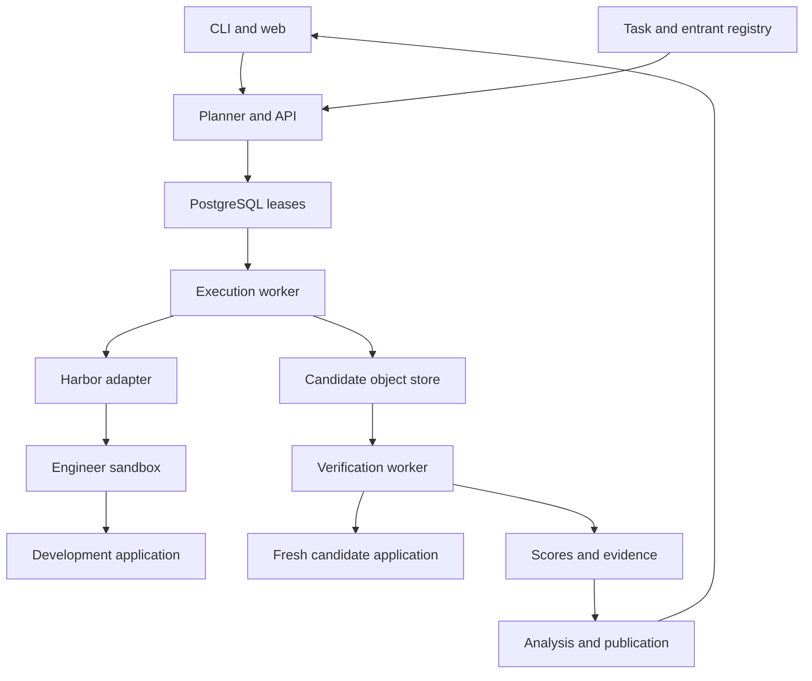
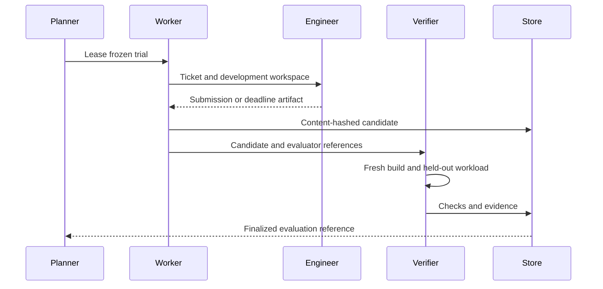

# AI Engineer Bench
# Implementation Specification and Software Delivery Plan

**Document version:** 1.0  
**Date:** 13 September 2026  
**Status:** implementation baseline proposed for development  
**Companion:** AI-Engineer-Bench-Architecture-v0.1.md  
**Product:** benchmark, execution package, independent evaluation operation, and public comparison website

This is a specification of software to implement, not documentation of an existing implementation. API paths, commands, schemas, limits, and acceptance tests below are requirements or proposed defaults. No benchmark scores are claimed. This document refines the architecture; its explicit decisions take precedence where the architecture left behavior open. Product release numbers, protocol versions, task versions, and this document version are independent.

## 1. Product promise

AI Engineer Bench measures whether coding agents can resolve real AI application engineering tickets and produce changes that work on independent tests. A visitor can compare entrants, inspect evidence, understand limitations, and run public development tasks locally.

The launch question is: **Can this agent diagnose and repair an AI application while preserving its required behavior?**

The product must not present fixture-only integration scores as evidence of general AI engineering ability, model-only intelligence, or production safety. The first release is explicitly the **AI Application Repair** suite. Build, migration, optimization, and deployment tracks can follow under new contracts.

## 2. Release scope and priority language

MUST is a release requirement. SHOULD can be deferred only through a recorded decision. MAY is optional. The backlog assigns every module to a delivery stage.

| Stage | Product users can actually use | Scope |
| --- | --- | --- |
| P0: vertical slice | Maintainer runs one task locally and gets an evidence report | CLI, schemas, executor, clean verifier, one task |
| P1: development preview | Developers run a public repair suite locally | Three then twelve tasks; two entrant integrations; JSON/HTML results |
| P2: public beta | Readers browse independently produced results | API, website, admin campaigns, publication/correction workflows |
| P3: official release | Readers compare a frozen reviewed campaign | Reviewed held-outs, complete protocol, reviewed evaluators and provenance |
| Later | Optional private evaluation and additional engineering tracks | Not a beta requirement |

P2 can publish development results clearly marked as development. P3 requires separate family-held-out official tasks or an explicit public-task evaluation designation. Twelve public tasks with private examples do not become an uncontaminated hidden benchmark.

No payments, subscriptions, social feed, marketplace, agent hosting service, arbitrary public repository execution, Kubernetes cluster, or automatic task-generation pipeline is required for P0–P3.

## 3. Primary users and permissions

| Role | Read | Write/execute | Restrictions |
| --- | --- | --- | --- |
| Visitor | Public releases, results, redacted evidence, documentation | Download public artifacts | No account required |
| Local developer | Public task bundles | Local commands with own credentials | Local output is not automatically official |
| Submitter | Own submission metadata and public content | Request evaluation of a configuration | No hosted execution button in beta |
| Operator | Campaign plans, infrastructure logs, raw run artifacts as assigned | Freeze/start/pause/cancel campaigns; propose invalidity labels | Cannot unilaterally publish results |
| Reviewer | Assigned evaluation evidence and task review material | Approve tasks, attribution, publication | Cannot approve own task or campaign in official release |
| Administrator | Account and deployment administration | Assign roles, rotate keys, suspend workers | Cannot silently rewrite published scores |

Use an existing OIDC identity provider for hosted maintainer access; do not implement passwords. Role assignments are stored server-side. Public beta submissions may be a documented issue template processed manually; a hosted submission form is not on the critical path. Official release requires two independent human identities for publication approval. If only one maintainer is available, label publications single-maintainer reviewed rather than implying independent review.

## 4. Product appearance and navigation

The website is an evidence-first engineering reference. Use a restrained light interface, dark readable text, one accent color, tabular numbers, clear verdict labels, and ample table space. A dark theme is optional. Do not fill empty charts with illustrative benchmark results.

Primary navigation: **Results · Compare · Tasks · Methodology · Run locally**. Secondary navigation: **Releases · Corrections · Contribute**. Admin navigation is visible only to authorized roles.

Default page selects the newest non-withdrawn publication explicitly labeled by suite, track, dependency mode, profile, and evaluation dates. The first screen shows the benchmark question, a methodology link, and a comparison table. Never advertise “best AI engineer” without the evaluated scope.

Design requirements:

- Desktop comparison table with sticky identifier column; horizontal scrolling on small screens; no hidden required context.
- Status always conveyed by text/icon as well as color.
- Semantic HTML tables, keyboard navigation, visible focus, accessible labels and contrast; charts have table equivalents.
- URL query parameters encode filters so a view is shareable; unknown parameters are ignored safely and invalid required values show a correction UI.
- Display UTC dates with local-time tooltip if available. Show full units and distinguish percentages from percentage-point differences.
- All numbers are API-provided or derived by the shared analysis package, not independently recomputed in front-end code.

## 5. Page-by-page UI specification

| Route | Main content | Actions | Required states |
| --- | --- | --- | --- |
| `/` | Product explanation and latest publication summary | View results, run locally | No publication: explain preview status and link to docs |
| `/results` | Cohort selectors, results table, coverage and uncertainty | Sort, filter, select up to 4 entrants, download JSON | Loading, empty cohort, partial cohort, withdrawn snapshot |
| `/compare` | Side-by-side configurations, paired task outcomes, cost/time | Change entrants, copy URL | Incompatible profiles: explain differences and disable paired statistics |
| `/entrants/:revision` | Exact version, model(s), settings, results by release | Open runs and configuration | Unavailable usage and stale version labels |
| `/tasks` | Category, activity, project family, public/retired status | Filter and open task | Empty search and deprecated tasks |
| `/tasks/:id/:version` | Ticket, environment, public requirements, origin, run command | Download public bundle | Official task: only released metadata/contract |
| `/runs/:id` | Verdict, requirements, diff, observable trace, usage | Download authorized artifacts | Redacted, partial trace, invalid attempt, superseded evaluation |
| `/methodology/:version` | Protocol, metrics, inclusion rules, limitations | Download protocol | Old protocol banner |
| `/releases/:id` | Frozen task list, cohort, dates, changelog | Open publication versions | Withdrawn/corrected status |
| `/corrections` | Append-only corrections and reasons | Inspect before/after publication | No corrections is an explicit empty state |
| `/docs` | Install/run/author/troubleshoot documentation | Copy commands | Version picker |
| `/admin/campaigns` | Plans, reservation status, progress, invalidity queue | Create/freeze/start/pause/cancel | Unauthorized, stale edit, budget rejected |
| `/admin/publications/:id` | Coverage audit, redaction, proposed snapshot | Review/approve/publish/withdraw | Own-review prohibited, missing evidence blocks publish |

Results table columns: entrant revision, resolved tasks estimate, valid/planned trials, per-category rates, all-k success with k label, median successful engineering time, cost per resolution, coverage badge, evaluation dates. Optional cost chart is hidden when fewer than two eligible entrants have adequate accounting.

Example layout content before scores exist:

| Entrant | Resolution | Valid trials | Cost / resolution | Provenance |
| --- | --- | --- | --- | --- |
| Selected agent revision | Not evaluated | 0 / planned | Unknown | Pending |

Evidence tabs: **Outcome, Changes, Actions, Application checks, Usage, Configuration**. Show evaluator findings separately from the entrant's narrative. Long traces are paginated/virtualized. Render candidate text and diffs as escaped text; do not execute HTML or terminal escape sequences. Official held-out inputs, answers, or raw application responses are not exposed by a “download all” button.

## 6. End-to-end user journeys

### 6.1 Reader compares agents

Open Results → select release/track/mode/profile → choose entrants → inspect paired differences → open failed tasks → inspect allowed evidence → download the immutable public result bundle. A cross-release comparison shows separate panels with a non-comparable label, never a calculated winner.

### 6.2 Developer runs locally

Install CLI → `aieb doctor` → configure credential references outside task files → download public task release → validate entrant capability → plan cost/time/trial count → run → inspect report. Local reports require no hosted account. Uploading or publishing is never automatic.

### 6.3 Contributor adds a task

Create a design issue with symptom and user impact → provide source/license provenance → create baseline and requirements → implement reference and verifier → add meaningful wrong solutions → demonstrate an alternative valid approach → run repeated resets → independent review → admit revision to a future release.

### 6.4 Operator produces a campaign

Create draft → resolve hashes and capability checks → review exact trial matrix and budget reservation → freeze manifest → start workers → monitor → resolve infrastructure-invalid attempts under policy → finish all planned cells or mark incomplete → aggregate → redact → request review → publish immutable snapshot.

### 6.5 Scoring correction

File correction → reproduce against retained candidate → classify documentation vs scoring defect → create evaluator revision if needed → regrade every affected candidate under the same revised contract → review → publish superseding snapshot. If retained evidence cannot support regrading, withdraw affected cohort and schedule a new campaign. Do not selectively rerun only failures.

## 7. Domain model and naming

Engineer agent means the contestant. Application means the software it repairs. Application dependencies include its model, index, services, and data. These identities and costs MUST remain separate.

| Entity | Identity/immutability |
| --- | --- |
| Task | Stable slug, e.g. `rag.document-freshness` |
| TaskRevision | Immutable source, ticket, requirements, evaluator and environment references |
| Family | Underlying application/project or shared mechanism for grouping and leakage control |
| SuiteRelease | Ordered task revisions and frozen weights |
| EntrantRevision | Agent/model versions, config, prompts, tools, capabilities and credential reference types |
| ProtocolRevision | Scoring, eligibility, retries, limits and statistical rules |
| Cohort | Track + suite + protocol + budget + mode + application dependencies + hardware class |
| Campaign | Immutable plan evaluating selected entrants within one cohort |
| Trial | One planned task/entrant/repetition; persistent through infrastructure replacements |
| Attempt | One physical execution; immutable logs and lease generation |
| Candidate | Allowed source snapshot and content manifest extracted at deadline/submission |
| Evaluation | One candidate against an evaluator/fixture/workload revision |
| Publication | Signed manifest of the chosen evaluations and analysis outputs |

Human slugs are not primary keys. Use UUIDs for records; deterministic SHA-256 for content. Hash canonical JSON with sorted keys, UTF-8, explicit nulls, finite numeric values and normalized schema-owned decimal strings. Hash resolved values, not YAML formatting. Test canonicalization against golden vectors. No floating point NaN/Infinity in API contracts.

## 8. Scientific tracks and eligibility

Agent track: vary the full declared contestant. Model track: use the same reference coding implementation, prompt, tools and execution policy; vary engineer model. Keep application settings fixed unless the task permits change.

Profiles declare allowed tools, network access, per-role budgets, engineer CPU/memory, application allocations, deadline and dependency mode. Models cannot be called “equally configured” when a provider does not expose a setting; capability metadata records this. Native/default settings are a different profile from standardized settings.

An entrant is eligible only if preflight verifies all required capabilities. Lack of complete usage does not automatically invalidate semantic results; it excludes hard-cost rankings where enforcement/accounting is insufficient. Lack of trace coverage appears as missing evidence, not an empty list implying no actions.

Credential account identity is confidential. Public configuration includes provider class, model requested/reported, agent version, relevant settings and declared extra models. If a version alias changes mid-campaign, pause and resolve before merging results.

## 9. System decomposition



Control plane: API, metadata, scheduling, publication. Execution plane: isolated engineer environments. Verification plane: trusted controller plus untrusted candidate build/application allocations. Evidence plane: immutable objects and redacted public exports. Logical modules can live in one Python codebase; isolation does not require microservices.

## 10. Technology and dependency decisions

| Component | Decision |
| --- | --- |
| Python package management | uv workspace with committed lockfile |
| Python baseline | Select a supported version intersecting pinned Harbor and our dependencies in compatibility spike; record in toolchain manifest |
| Validation | Pydantic, strict enums, generated JSON Schema |
| CLI | Typer; rich terminal output with plain/no-color mode |
| API | FastAPI, SQLAlchemy, Alembic |
| Metadata | PostgreSQL; local JSON/filesystem adapter for CLI |
| Work scheduling | PostgreSQL leased jobs; no Redis required initially |
| Artifacts | Local filesystem or S3-compatible object store |
| Web | React, TypeScript, Vite, React Router, TanStack Query/Table |
| Web tests | Playwright plus component/unit tests |
| Evaluators | Trusted Python checkers/Pytest; external HTTP drivers |
| Container execution | Harbor backend behind AIEB interface; official workers in disposable VM allocations |
| Monitoring | Structured JSON logs, OpenTelemetry-compatible spans and metrics |
| Front-end packages | pnpm lockfile; Node version pinned after compatibility check |

Do not specify “latest” dependencies. The first engineering ticket resolves exact versions and runs the compatibility spike. Use generated OpenAPI types instead of duplicating API definitions in TypeScript. Dependencies may be upgraded only through a tested versioned PR; changes to behavior can require a new benchmark protocol/cohort even when the software upgrade is minor.

## 11. Monorepo and dependency graph

| Directory | Owns | Allowed dependencies |
| --- | --- | --- |
| `packages/aieb-core` | Schemas, IDs, profiles, planning, metric definitions | No API/web/Harbor imports |
| `packages/aieb-runner` | Execution adapter, workers, artifact handling | core, Harbor adapter dependencies |
| `packages/aieb-evaluators` | Public verifier primitives, report contracts | core; no contestant code imports |
| `packages/aieb-analysis` | Aggregations, uncertainty, exports | core and statistical libraries |
| `packages/aieb-cli` | User commands and local orchestration | core, runner, analysis |
| `services/api` | Persistence, auth, admin/public API | core, analysis; workers communicate through repository/service layer |
| `apps/web` | UI | Generated API types; no scoring implementation |
| `suites/dev` | Public tasks and fixtures | Versioned task SDK |
| `infra` | Images, worker/service deployment | Build artifacts only |
| `docs` | Protocol, author guide, operations and decisions | None |

Keep a separate private evaluation repository/bucket with exact source hashes. Do not copy private files into public build context and rely on `.gitignore` or an obscure directory name.

## 12. Task package and authoring contract

Canonical AIEB task files:

| File/path | Purpose | Contestant sees it? |
| --- | --- | --- |
| `task.yaml` | Metadata, contracts, references | Public portion |
| `instruction.md` | Ticket and requirements | Yes |
| `repo/` | Frozen editable application source | Yes |
| `dev_tests/`, `dev_data/` | Visible diagnostic examples | Yes |
| `environment/` | Images/service definitions | Runtime-visible portion |
| `contracts/` | Public API and submission contract | Yes |
| `reference/` | Reference implementation | Local reference mode; not official contestant workspace |
| `counterexamples/` | Invalid candidate implementations | Maintainer validation only |
| `provenance.json` | License and source adaptation notes | Public unless sensitive |

Official fixtures and scorer answer keys are separately resolved by verifier identity. The task author may include public development evaluators; official run images must be constructed from an explicit allowlist to prevent accidentally bundling reference fixes.

Task schema fields and validation:

| Field | Type | Rule |
| --- | --- | --- |
| schema_version | string | Supported exact major version |
| id, version, family_id | strings | Nonempty; immutable revision uniqueness |
| category | enum | rag, extraction, tool_app initially |
| activity | enum | repair initially |
| source | object | Repo commit/content digest, license, provenance |
| environment | object | Image digests, resources, service topology, egress policy |
| application | object | Entrypoint, healthcheck, API contract, dependency profile |
| submission | object | Included paths, protected paths, size/type limits |
| requirements | array | Unique IDs, publicly stated behavior, mandatory/diagnostic flag |
| evaluator | object | Code digest, development fixture, official fixture reference |
| profile_compatibility | array | Allowed resource/dependency profiles |

Absolute file paths, globs escaping the repo, unresolved image tags, duplicate requirement IDs and missing licenses reject admission. Avoid broad `**` submission globs where task-specific paths suffice. Every hidden check maps to a public requirement ID.

## 13. Entrant and campaign configuration

EntrantRevision stores `track`, `agent_implementation`, `agent_version`, `engineer_model`, `settings`, `prompt_digest`, `tools`, `extra_models`, `capabilities`, and `credential_ref`. A credential reference names a secret binding; it never contains a secret value. Store requested and observed runtime configuration separately and reject material mismatch.

Illustrative proposed campaign YAML (not a Harbor schema):

```yaml
schema_version: aieb.campaign/v1
name: repair-pilot
suite: ai-application-repair-dev@0.1.0
protocol: repair-protocol@0.1.0
track: agents
entrants:
  - agent-a@pinned-revision
  - agent-b@pinned-revision
profile: cpu-fixture-standard@0.1.0
task_ids: [rag.document-freshness, extraction.batch-alignment, tools.false-completion]
repetitions: 3
order_seed: 4107
max_concurrent_trials: 2
invalid_attempt_policy:
  max_replacements: 2
  action_on_exhaustion: mark_incomplete
publication:
  intended_status: development
```

Planner resolves references, creates an ordered canonical manifest, prints 18 trials, estimates cost bounds, validates cohort compatibility, and freezes a manifest digest. Unresolved budget or hardware fields prevent official dispatch. Draft editing uses optimistic revision control. Any change after freeze creates a new campaign; pausing does not permit editing the frozen plan.

## 14. Runtime state and authority

Campaign states: DRAFT → FROZEN → RUNNING → COMPLETED; RUNNING may become PAUSED or CANCELLING; PAUSED resumes RUNNING without plan changes; CANCELLING becomes CANCELLED; missing required final trials yields INCOMPLETE. Publication status is separate.

Attempt phases: QUEUED, PROVISIONING, ENGINEERING, COLLECTING, BUILDING, VERIFYING, FINALIZING, TERMINAL. Every phase transition is appended and checked against expected previous phase and lease generation.

Terminal execution outcomes: SCORED, INFRASTRUCTURE_INVALID, CANCELLED. Scored verdicts: PASS, FAIL, CONTRACT_VIOLATION. INDETERMINATE evaluation is retained but blocks canonical publication for that cell until adjudicated or declared incomplete. Never turn an unavailable score into zero silently.



## 15. Exact trial execution procedure

1. Acquire resource and spend reservation. Validate worker capability and lease.
2. Resolve task blobs from trusted storage; verify all digests before executing build/setup.
3. Provision isolated development allocation. Mount only allowed source, public data and docs.
4. Start application dependency services with fresh volumes and a run-scoped network.
5. Healthcheck immutable baseline services. Setup failure before candidate work is infrastructure-invalid unless caused by the entrant installer/configuration; see attribution table.
6. Install/start the pinned entrant under the declared account and tools. Record observed version.
7. Start monotonic engineering clock at first ticket delivery after successful setup. Provisioning time remains separately recorded.
8. Allow agent code edits and development calls. Track role-separated usage and resource limits.
9. On normal finish or deadline, block further writes/calls and terminate all contestant processes. Allow a fixed platform collection interval with no editing.
10. Validate filesystem boundaries and protected files. Extract allowed new, modified and deleted files into a manifest; do not depend solely on `git diff`.
11. Save candidate and trace objects, verify checksums, issue a verifier work item.
12. Fresh build replays allowed candidate files onto the original task base. Dependency updates obey the task edit policy and pinned package mirror.
13. Run candidate service in an untrusted allocation, with no official labels or host access.
14. Trusted verifier sends test inputs across the declared API; separately records authoritative external state.
15. Evaluate all mandatory requirements and produce a signed-by-worker result envelope; host ingestion verifies service identity and hashes.
16. Commit verdict references transactionally; release unused reservations; clean all task resources.

An engineering timeout does not automatically fail a correct artifact: the artifact existing at the deadline is eligible under the artifact-at-deadline protocol. Record termination reason even on PASS. No artifact, build failure, failed checks or resource violation still fail. Host collection/build cannot grant additional engineering time. Verification timeout caused by candidate hanging is FAIL; verifier infrastructure timeout is invalid under evidence-based attribution.

## 16. Infrastructure attribution, cancellation and replacement

| Event | Classification | Replacement? |
| --- | --- | --- |
| Trusted base image unavailable or host disappears | Infrastructure invalid | Up to policy limit |
| Entrant package/setup fails due to wrong submitted configuration | Entrant failure | No score-improving retry |
| Candidate imports missing declared dependency | Build failure | No |
| Candidate exceeds memory/disk/process budget | Resource failure | No |
| Provider is unavailable for valid requests across health probes | Infrastructure invalid/provider outage | Under frozen provider policy |
| Entrant sends invalid API parameters | Entrant failure | No |
| Entrant exceeds own allowed concurrency and gets rate-limited | Budget/policy-related entrant failure | No |
| Application service fails because of submitted code | Application failure | No |
| Trusted scorer crashes on valid protocol response | Evaluator error | Repair and regrade affected cohort |
| Candidate returns malformed/oversized response | Contract failure | No |
| Operator cancels after observing poor performance | Cancelled campaign/cell | Not eligible as complete official campaign |

Ambiguous attribution enters review with logs; operator cannot erase it. Replacements keep original trial ID, increment attempt number, and reset engineering state completely. Maximum is two replacements in the initial profile. Exhaustion marks trial unresolved and campaign incomplete. The first valid scored attempt is final; do not choose best attempt.

Pause stops new dispatch and lets active attempts finish. Emergency cancel kills active runs, records partial artifacts where possible, and marks incompleteness. Recovery after host loss reconciles existing executions before creating replacements. No workload is automatically continued in a contaminated sandbox.

## 17. Harbor adapter and capability gate

Keep all Harbor imports under `aieb_runner/backends/harbor/`. AIEB does not expose Harbor-specific schemas as its permanent API. Retain Harbor raw outputs as restricted artifacts and normalize them into AIEB result contracts.

```python
class ExecutionBackend(Protocol):
    async def preflight(self, trial: ResolvedTrial) -> CapabilityReport: ...
    async def launch(self, trial: ResolvedTrial) -> ExecutionHandle: ...
    async def poll(self, handle: ExecutionHandle) -> ExecutionStatus: ...
    async def stop(self, handle: ExecutionHandle, reason: StopReason) -> None: ...
    async def collect(self, handle: ExecutionHandle) -> ArtifactManifest: ...
    async def cleanup(self, handle: ExecutionHandle) -> CleanupReport: ...
```

`preflight` checks agent version pinning, required services, time/resource enforcement, egress controls, artifact extraction and usage support. Refuse unsupported official configurations before spending. Lifecycle hooks are not universal tool interceptors. Partial log coverage is explicitly represented. Fixture services record their own requests independently of agent traces.

Compatibility spike MUST prove one installed agent can edit a multi-service task, be stopped at deadline, submit allowed new files, and have those files evaluated independently after teardown. Pin the passing Harbor version in the lockfile and toolchain manifest. Current documentation and earlier source inspection are inputs to the spike, not proof it passes.

## 18. Reference execution setup for the model track

Implement only after agent-track P0 works. Keep a small pinned tool-calling loop: read files, list files, search, apply patch, run bounded command, inspect command output, submit. Tool schemas, system prompt, context truncation and iteration limit are versioned. Commands run in the same engineering sandbox as full agents; tools cannot read verifier material.

Use provider adapters that preserve declared model parameters. Tool-call parse failure, unsupported tool use and provider errors have explicit handling and logs. Retries are bounded and count against the engineering budget. No silent fallback to a stronger model. Context management strategy is fixed within the model track; provider-specific context limits create disclosed profiles when necessary.

A model-track result describes the model in this setup. No claim that it isolates every model property or predicts all agent products.

## 19. Application dependency modes

Fixture mode measures integration correctness. Local versioned services implement deterministic embeddings, extraction responses and tool outcomes across a documented input domain. Unknown calls are explicit errors; no default answer that accidentally passes. Fixture implementations cannot inspect hidden labels. Seeds and fixture revision are frozen.

Live mode measures behavior involving a real application model. Pin requested model, response settings and provider profile. Record actual reported identity, request timings and repeat evaluation policy. Repeat application checks m times per candidate using a frozen acceptance rule; these are nested evaluations, not new engineering trials.

Engineering-mode and verification-mode application dependencies obey the same public contract but may use held-out instances. Do not give one entrant a stronger application model. Tickets permitting application-model changes list allowed choices, budgets and measurement rules. Publish fixture and live scores in different cohorts.

## 20. Model access and cost broker

Three actor roles: ENGINEER, DEV_APPLICATION, VERIFIER_APPLICATION. Judge usage is VERIFIER_JUDGE. Infrastructure costs are a separate ledger. Every provider request carries an attempt/evaluation-scoped token, model allowlist and maximum output budget.

For hard-cost profiles, reserve a conservative upper bound before dispatch: known input usage estimate plus allowed output/reasoning maxima at a frozen price schedule. Reject when a reliable upper bound is unavailable; such a provider can use a time-limited estimated-cost profile instead. Pending in-flight requests reserve spend and cannot overdraw shared caps.

State per request: RESERVED → DISPATCHED → SETTLED or UNKNOWN. A transport disconnect may still incur cost; never release an unknown reservation as zero without reconciliation. Record retries as separate physical requests. Idempotent usage ingestion de-duplicates a repeated receipt without hiding separate billed calls.

Source hierarchy: broker/provider usage where available, adapter-reported usage, estimated usage. Do not add broker and adapter totals for the same request. Record discrepancy and reconciliation. Prices are dated reference estimates, not promises about vendor invoices. Subscription agents without allocatable per-run costs display unavailable cost and remain outside monetary comparisons.

## 21. Candidate artifact and build contract

Candidate manifest lists relative paths, operation (add/modify/delete), regular-file type, byte length, SHA-256 and executable flag. Preserve an exact full-tree hash and base revision. Canonical archive generation sorts paths and normalizes irrelevant archive metadata; file content is unchanged.

Reject absolute paths, `..`, escaping links, hardlinks, devices, sockets, excessive file count, compressed expansion beyond limit and protected-path modifications. Initial package cap 50 MiB and 10,000 files, configurable by task profile. Source/task contents are synthetic or licensed; artifact limits do not justify silently dropping files.

Build occurs without privileged host mounts or evaluator credentials. No network except a frozen dependency mirror if task policy allows installation. Dependency edits must include lock changes; build command and package indexes are controlled. Build logs remain untrusted text. Candidate's own tests may run for diagnostics, but cannot define the official verdict.

Store artifacts under content digests. Restricted/public visibility belongs to artifact references, not merely the underlying blob; identical bytes with different permissions do not grant access. Public export uses a separate redacted object and digest.

## 22. Trusted verifier design

The verifier controls setup, input sequence and expected outcomes from outside the candidate application. It may use trusted Python assertion code but MUST NOT import candidate modules into the trusted process. Verify over HTTP/IPC or isolated command output with strict size/time constraints.

Evaluator interface:

```python
class Evaluator(Protocol):
    def validate_fixture(self, fixture: FixtureRef) -> ValidationReport: ...
    async def evaluate(self, candidate: CandidateHandle,
                       plan: EvaluationPlan) -> EvaluationResult: ...
```

EvaluationPlan specifies task/evaluator/fixture hashes, required public contract IDs, workload seed/schedule, application budget and repeat policy. EvaluationResult lists each check as PASS/FAIL/ERROR/NOT_RUN, evidence references, numeric diagnostics and coverage. Any mandatory NOT_RUN/ERROR prevents PASS and triggers attribution logic.

Scoring order: environment health → candidate startup → contract → ticket requirements → regression checks → resource constraints. Failure of startup permits downstream NOT_RUN but scientific verdict is FAIL, not indeterminate. Independent scorer crash is an error to repair, not an agent failure. Tests that can safely run after a failure SHOULD continue to provide diagnostics.

## 23. Primary scoring contracts by family

| Family | Primary deterministic checks | Additional semantic mode |
| --- | --- | --- |
| RAG | Document/version IDs, retrieval order, filter behavior, deletion, citation mapping | Reference-supported answer facts and abstention on live application |
| Extraction | Typed field equality with declared normalization, document correspondence, units, missingness, per-item errors | Live extraction outputs scored with same contract |
| Tool application | External operation ledger, required/forbidden effects, response status, session isolation | Live tool planning/correction across repeated requests |

String normalization is explicit per field: whitespace, Unicode, case, date formats, currency/units and tolerance. No blanket fuzzy matching. Missing values differ from empty strings and zero. Numeric tolerances are declared before evaluation.

LLM judges are optional secondary diagnostics in initial release. Any judge promoted to primary scoring requires human-labeled validation, inter-rater agreement, frozen prompt/model and an appeals protocol. Store judge uncertainty and failures. Do not allow a judge to replace the authoritative tool-state or data contract.

Optimization tasks later must specify a minimum quality floor and controlled hardware workload; a speed gain with a violated quality floor does not pass. Measurements compare candidate and baseline under matched randomized blocks, and report cold/warm conditions separately.

## 24. Fully specified first task: RAG-01

**ID:** `rag.document-freshness`. **Family:** `knowledge-service-a`. **Activity:** repair.

Ticket: updated documents sometimes return old passages and deleted documents remain searchable. Repair incremental ingestion while preserving search for unaffected documents. The source fixture deliberately uses append-only chunk insertion and lacks proper version/deletion handling. Do not require the exact reference patch.

Public application contract:

| Method/path | Input | Required output/behavior |
| --- | --- | --- |
| GET `/health` | None | Ready status |
| POST `/documents` | id, integer version, text | Store newest accepted version; repeating same id/version/text is idempotent |
| DELETE `/documents/{id}` | version in request | Tombstone at version; no stale resurrection |
| POST `/search` | query, top_k, optional metadata filter | Hits contain id, version, chunk_id, text; only current nondeleted versions |

Version ordering is part of the ticket: lower versions cannot supersede newer ones; equal version with different payload returns conflict; a higher-version update after deletion may recreate a document. Initial test uses sequential events; concurrency is not a hidden requirement. Client-visible readiness semantics state when updates must be queryable: before the mutation response completes in this first task.

Hidden workload: create N documents from a held-out corpus; query control hits; update a subset with unique replacement facts; replay identical events; submit lower versions; delete a subset; attempt stale reinsertions; submit valid higher-version re-creations. Verify current text/version and unaffected records across held-out queries. Stable snapshot order and seeds are retained.

Incremental requirement: an external development/search backend tracks writes. Mutating one document may rewrite its own chunks but may not delete/rebuild unrelated document entries. The task names this externally measurable constraint; evaluator does not ban a particular library or code style.

Reference solution: version-aware replace of a document's chunks plus durable tombstone/version records. Alternative solution: immutable version entries with an authoritative current-version filter and bounded index maintenance. Both must pass the same behavior contract.

Required failing candidates: no-op baseline; returning a hardcoded known document; filtering deleted documents only in visible test queries; deleting all rows on every update; accepting stale writes after deletion; correct retrieval with incorrect citation version. Official fixture generation is deterministic for maintainer replay and absent from contestant image.

Acceptance: baseline fails intended requirements; reference and alternative pass 10 fresh fixture resets; each counterexample fails its mapped check; two independent normal agent runs produce valid artifacts/evidence without leaking labels. Ten resets test evaluator mechanics, not agent reliability.

## 25. Complete initial task backlog

| ID | Ticket and intended defect | Held-out check | Preserved behavior / shortcut control |
| --- | --- | --- | --- |
| RAG-01 | Stale document versions and deletion | Versioned event replay | Unchanged documents not rebuilt |
| RAG-02 | Metadata filters applied after top-k | Relevant matching docs below unfiltered cutoff | No cross-filter results; respect top_k |
| RAG-03 | Citation offsets/IDs break after chunk updates | Map every citation to current source span | Retrieval still returns relevant current content |
| RAG-04 | Embedding version changes silently mix spaces | Index embeds/version metadata and query compatibility | Explicit migration or safe rejection under public contract |
| EXT-01 | Missing values replaced with invented defaults | Missing vs zero/empty across typed fields | Present fields remain accurate |
| EXT-02 | Batch output order mismatches document IDs | Permutations, partial failures, repeated IDs policy | No dropped or duplicated valid documents |
| EXT-03 | Units normalized incorrectly | Declared conversions and decimal tolerances | Keep original evidence and unaffected fields |
| EXT-04 | One malformed model response discards a batch | Mixed valid/malformed result set | Per-item status and successful outputs retained |
| TOOL-01 | Failed operation produces success response | External tool ledger and application status | Genuine success still reported correctly |
| TOOL-02 | Ambiguous write retried without deduplication | Commit then suppress response | Exactly requested effects, not global refusal |
| TOOL-03 | Session state reused across users | Interleaved sessions with synthetic identities | Each session can still complete its own request |
| TOOL-04 | Corrected request uses stale tool arguments | User correction before action | Corrected target changed; original untouched |

Use at least six base application projects when reaching twelve tasks. Pair families for analysis and split management. Externally induced tool behavior in TOOL tasks tests whether the repaired application handles it, not whether the engineer's own tool-call loop recovers.

## 26. Task authoring, admission and versioning

Task authors follow a reviewable design template: user impact, symptom, public contract, scope/non-goals, baseline defect, reference, alternatives, fixtures, evaluator, counterexamples, compute needs, license, provenance and scoring risks.

Admission checks MUST include deterministic fixture generation; clean start/reset; baseline failure; reference success; relevant alternative success; targeted shortcut failures; reproducible builds; package visibility inspection; frozen public requirements; documented resource profile. At least one reviewer other than author signs official admission.

Task lifecycle: DRAFT → VALIDATED → REVIEWED → PILOTED → RELEASED → DEPRECATED or WITHDRAWN. Task revisions never mutate. Documentation-only correction can create patch revision if behavior is unchanged; any scoring/source/fixture change creates new revision with comparability decision. Suite releases freeze exact revisions, ordering and weights. Official old results remain addressable.

All public source reuse needs redistributable licensing and attribution. Do not copy private office repos or customer data. Public incidents may inspire synthetic cases but must not be described as exact reproductions without evidence. Case variety matters more than multiplying superficial variants.

## 27. Holdouts, contamination and evaluator disclosure

Maintain three labels: public development, official public-origin, official held-out family. Public development includes references. Official public-origin uses publicly known tasks but undisclosed data; do not call it contamination-free. Held-out family includes distinct application/task packages administered privately until retirement.

Hidden checks test disclosed requirements, not surprise constraints. Submitters receive redacted category outcomes after a campaign, not unlimited per-example feedback. Repeated official submissions are rate-limited administratively to reduce test-set tuning. Record submission history and exposure. Public artifact release after retirement requires license/redaction review.

Fixtures are generated from versioned seeds and corpus snapshots. Random renaming alone does not establish novelty or training exclusion. Store overlap/provenance reviews as admission evidence. The official suite is an ongoing curation obligation, not a one-time hidden JSON file.

## 28. Statistics, aggregations and comparative claims

For task t, entrant a: s valid passes out of n valid planned repetitions gives p_hat=s/n. Suite resolution is mean(p_hat) across the frozen task list with predetermined weights. Default equal task weights; publish family/category breakdowns. Assertion count is never a task weight.

Repeatability: publish s/n per task and empirical all-k success for a fixed k. Optional pass^k estimate is C(s,k)/C(n,k) for n>=k; distinguish from pass@k. Do not exponentiate a suite-average probability to obtain suite repeatability.

Per-task intervals: Wilson 95% intervals, noting independence assumptions. Paired aggregate differences use the same task cells, resampling projects/families then repetitions according to the declared hierarchical model. With six projects, intervals are exploratory; no universal rank claim. Pairing uses common task/fixture schedules, not the fiction that provider random seeds make engineer trajectories identical.

Canonical leaderboard eligibility requires every planned task cell to have the planned number of valid final trials, with no unresolved evaluations. Incomplete campaigns get separate coverage tables and optional bounds: count missing trials as all-fail/all-pass to show possible ranges, never a hidden denominator change. Publish infrastructure attrition by entrant to reveal selection effects.

Cost per resolution = engineer + development-application cost for all scored trials / successful resolutions. Report verifier and infrastructure expenses separately; publish total campaign cost including invalid attempts. Zero successes gives undefined cost/resolution. Missing accounting produces unavailable estimate unless a clearly labeled partial lower bound is useful.

Report median successful engineering time plus all-trial deadlines and failures. Application latency is measured separately. No p95 UI for small samples; initial display requires at least 100 eligible observations and still reports count/interval policy. Statistical significance is not automatic practical importance; campaign plan names the minimum effect of interest before measurement.

## 29. Sample sizes and compute planning

P0 smoke runs validate engineering mechanics, not rankings. P1 pilot: 3 tasks × 2 entrants × 3 repetitions = 18 engineering trials. Full development campaign example: 12 × 3 × 5 = 180 per mode/profile. Fixture and live modes together produce 360 engineering trials if both are independently run; re-evaluating the same candidate in another mode must instead be labeled candidate re-evaluation and cannot be counted as new engineering attempts.

Proposed initial engineering deadline 1,200 seconds; verifier deadline 300 seconds; actual per-service CPU/memory/storage budgets are calibrated with reference tasks and frozen. No official monetary caps are invented before provider choice and pilot accounting. If required caps cannot be enforced, use a time-budget cohort and show cost estimates.

Plan includes worst-case requested engineer, application, evaluator and VM resources plus allowed infrastructure replacements. Reserve before dispatch. Time-block entrant ordering is randomized/interleaved using a stored order seed. Worker overcommit is disallowed for performance measurements. Load from neighboring tasks is recorded or eliminated through dedicated allocations.

## 30. Persistence schema and indexes

Hosted database uses UTC timestamps, UUID keys, foreign keys, check constraints and explicit transaction boundaries. Resolved manifests live as JSONB alongside typed searchable columns; JSONB does not replace core referential integrity.

| Table | Required columns beyond id/timestamps | Important constraint/index |
| --- | --- | --- |
| users, role_bindings | oidc_subject, role, scope | unique subject; scoped role |
| task_revision | slug, version, family_id, category, source_digest, manifest_digest, evaluator_id | unique slug/version; family/category index |
| evaluator_revision | code_digest, contract_version, review_status | unique code_digest/contract |
| fixture_revision | digest, visibility, family_id | access-controlled ref |
| suite_release, suite_task | release version/status; ordered task refs, weights | unique release/task; frozen on release |
| entrant_revision | slug/version, track, config_digest, capabilities | unique config_digest |
| campaign | manifest_digest, cohort_digest, state, draft_revision, reservation_id | state index; frozen content immutable |
| trial | campaign_id, task_revision_id, entrant_revision_id, repetition, cell_digest | unique campaign/task/entrant/repetition within cohort |
| attempt | trial_id, number, worker_id, phase, terminal_status, lease_generation | unique trial/number |
| work_item | attempt/evaluation ref, type, state, lease_expiry, generation | partial index on ready/lease_expiry |
| candidate | attempt_id, tree_digest, manifest_digest, validation_status | unique attempt/tree |
| evaluation | candidate_id, evaluator_id, fixture_id, schedule_digest, verdict | unique evaluation-plan digest |
| artifact, artifact_ref | content_digest, size, media_type; owner/visibility | digest unique; authorization on reference |
| usage_request, usage_receipt | actor_role, request_id, reservation, reported/estimated values | unique scoped request/receipt identity |
| publication | campaign_id, snapshot_digest, status, supersedes_id, reviewer_id | immutable snapshot; chronology index |
| review, audit_event | reviewer, target revision, decision, evidence | append-only writes |

Use decimals or integer micro-USD for money, not binary float. Token counts are nonnegative nullable integers. `NULL` means unknown, distinct from zero. Scores use explicit numerator/denominator as well as rendered values.

## 31. Work leasing and crash recovery

Acquire work in a short transaction using row locking with SKIP LOCKED, increment generation, record worker and lease expiry, then commit before long operations. Initial heartbeat 10 seconds and lease 60 seconds; make these deployment settings with tested expiry behavior.

Finalization requires matching worker and generation; stale workers cannot commit results after reassignment. Heartbeats update only matching active leases. Workers are idempotent by attempt/evaluation identity. Exactly-once physical execution is not assumed; unique authoritative finalization is enforced. Stop/reconcile orphan executions before replacements to prevent resource/cost duplication.

Artifacts upload first to immutable storage, then result references finalize transactionally. On crash, reconciliation checks uploaded manifests/digests and either resumes finalization or records invalidity. Orphaned unreferenced staging objects expire after 24 hours by default; committed evidence is never deleted by that cleanup job. Worker liveness, task validity and scientific scoring are distinct states.

## 32. Event, artifact and result envelopes

```json
{
  "schema_version": "aieb.event/v1",
  "event_id": "uuid",
  "attempt_id": "uuid",
  "source": "application-ledger",
  "sequence": 14,
  "occurred_at": "2026-09-13T12:00:00Z",
  "received_at": "2026-09-13T12:00:00Z",
  "actor_role": "DEV_APPLICATION",
  "type": "tool.result",
  "payload": {"operation_id": "opaque-id", "status": "error"},
  "artifact_refs": []
}
```

Values above are illustrative schema examples. Sequence uniqueness is attempt/source/sequence. Separate clocks cannot establish exact cross-source order; link request/operation IDs for causality. Payload limits are validated; large outputs become artifacts.

EvaluationResult: schema_version, evaluation_id, candidate_digest, evaluator_digest, fixture_digest, schedule_digest, checks[{requirement_id,status,evidence_refs}], verdict, validity, termination_reason, diagnostics, usage_coverage, started_at, finished_at. Ingestion recomputes/checks manifest digests and validates relationships, not merely the shape.

Failure taxonomy records observations: build_failure, startup_failure, api_contract_failure, retrieval_error, extraction_error, tool_state_error, regression, resource_violation, artifact_violation, provider_outage, host_failure, evaluator_error. A causal diagnosis such as “context loss” requires separately attributed reviewer evidence; it is not inferred automatically from a failed run.

## 33. API behavior and errors

All routes are `/v1`; return JSON with stable IDs, schema versions, request ID and typed errors. Lists use cursor pagination with default 50/max 200. Mutations require idempotency key and role scope. Same key/body returns prior response; same key/different body returns 409. Retain keys for 7 days and never recycle a committed action within that window.

| Method/route | Role | Request/response |
| --- | --- | --- |
| GET `/releases` | Public | Published release summaries |
| GET `/tasks/{slug}/revisions/{version}` | Public | Public contract and artifact refs |
| GET `/entrants/{id}` | Public | Sanitized immutable configuration |
| GET `/publications/{id}/results` | Public | Frozen per-entrant/task aggregates |
| GET `/comparisons` | Public | publication_id + entrant_ids + filters; eligibility and paired statistics |
| GET `/trials/{id}` | Authorized | Redacted public or scoped private record |
| GET `/artifacts/{ref}/download` | Authorized | Short-lived URL for authorized reference |
| POST `/campaigns` | Operator | Draft from resolvable manifest |
| PATCH `/campaigns/{id}` | Operator | Draft revision with If-Match |
| POST `/campaigns/{id}/freeze` | Operator | Validate and hash plan |
| POST `/campaigns/{id}/start` | Operator | Reserve and enqueue; 202 |
| POST `/campaigns/{id}/pause` | Operator | Stop new dispatch |
| POST `/campaigns/{id}/resume` | Operator | Continue frozen plan |
| POST `/campaigns/{id}/cancel` | Operator | Irreversible cancellation record; 202 |
| POST `/reviews` | Reviewer | Signed decision with evidence refs |
| POST `/publications` | Reviewer/operator workflow | Create reviewed immutable snapshot |
| POST `/publications/{id}/withdraw` | Authorized reviewer | Reason and replacement reference if any |

Errors: 400 invalid request syntax; 401 unauthenticated; 403 insufficient role; 404 nonexistent or non-disclosable resource; 409 state/cohort/idempotency conflict; 412 stale revision; 422 schema/semantic validation; 429 rate limited; 503 service unavailable. Error object has code, safe message, field_errors, request_id, retryable. No secret values or raw stack traces in public responses.

## 34. CLI commands and exit behavior

| Command | Behavior |
| --- | --- |
| `aieb doctor` | Check runtime, container backend, credentials references, disk and network policy |
| `aieb task init <dir>` | Generate author template with unresolved required fields |
| `aieb task validate <dir>` | Static/schema/provenance checks, no paid calls |
| `aieb task verify <dir> --candidate reference` | Execute evaluator admission checks |
| `aieb plan --campaign <file>` | Resolve/print matrix, eligibility and cost bounds without running |
| `aieb run --campaign <file>` | Execute declared local campaign |
| `aieb resume <campaign-id>` | Reconcile interrupted local control process under same manifest |
| `aieb inspect --trial <id>` | Show attempts, evidence and result |
| `aieb report --campaign <id> --format html` | Build local static report |
| `aieb compare --campaign <id> --entrants <a> <b>` | Enforce comparability and print differences |

Exit 0 means command completed successfully, not all benchmark tasks passed. Exit 2 invalid config, 3 missing capability, 4 infrastructure-incomplete campaign, 5 explicit `--fail-on-unsolved` gate failure, 130 user interrupt. Normal benchmark failures are data, not CLI crashes. `--json`, `--no-color` and deterministic report outputs are required. No secrets accepted as mandatory command-line arguments; use environment/secret files with restricted permissions.

Local state directory contains frozen campaign manifest, attempts, candidate/evaluation references, JSONL events and report. Store a local writer lock; prohibit concurrent mutation by two CLI controllers. Resuming checks manifest hashes and never silently expands repetitions.

## 35. Front-end implementation details

Generated API client/types are checked in or reproducibly generated in CI. TanStack Query keys include publication/cohort and filter values. Read-only publication responses can be cached indefinitely by digest; mutable campaign responses have short polling intervals (5 seconds default while active) and exponential backoff on errors.

Use URL-backed filters and stable multi-column sorting. Numeric nulls sort last and display Unknown/Not applicable based on reason. Show counts next to percentages; never round distinct values into apparently significant rankings. Compare up to four entrants to preserve readability. Downloaded reports carry the same publication ID and protocol hash shown on screen.

Client errors present a retry action and request ID. Empty states explain next action; no placeholder leaderboard scores. Admin long actions show acknowledged pending state and poll authoritative status; do not optimistically mark a campaign published. Destructive cancellation/withdrawal shows consequences and requires an explicit UI action; this is product behavior, not a request for permission to write this specification.

## 36. Publication and provenance

Publication pipeline: freeze selected evaluation IDs → verify cohort completeness → compute analysis with pinned analysis version → validate cost/trace coverage → generate redacted evidence → reviewer signs → create snapshot manifest → expose public pointer atomically.

Snapshot contains suite, protocol, entrant/config hashes, task/evaluator revisions, trial coverage, exclusions, aggregate artifacts, analysis version, dates and approval records. Sign manifest with deployment-managed key; verification endpoint exposes public key/version. Signature proves provenance, not scientific truth.

Provenance labels: centrally executed, independently reproduced, self-reported. Only centrally executed/reproduced results admitted to the official comparison cohort under published rules. Self-reported uploads cannot be merged by claiming the same task ID.

Corrections are append-only. Withdrawal leaves a tombstone and reason. A new evaluator revision regrades all affected candidates if inputs/artifacts remain sufficient; re-execution under changed live dependencies is a new campaign, not a silent regrade. Official hidden examples are redacted until retirement.

## 37. Security model

Threats: contestant reads labels; modifies scoring; escapes sandbox; steals provider credentials; reaches another run; exfiltrates hidden inputs; poisons artifacts/log rendering; consumes unbounded compute. Treat accidental bugs and malicious contestants within the same boundary model.

Official allocation requires VM or equivalent hardened isolation, nonprivileged containers, no Docker socket, no control-plane/cloud-metadata access and no cross-trial mounts/network. Candidate application and build are untrusted even after engineer process termination. Verifier has a separate identity and no inbound route from contestant to its control API. Egress is deny-by-default except scoped model broker/application fixture routes.

Use per-attempt short-lived service credentials; revoke on termination. Public artifacts are separately redacted and authorized. Hide private resources with 404 to unauthorized users. Escape logs, cap parser depth/size, validate archive paths and scan uploads for accidental secrets. File scans supplement, not replace, isolation.

Before public execution is enabled, run threat-model review and sandbox escape/label-access tests. P2 accepts known centrally configured entrants; public arbitrary execution remains deferred. Billing keys, hidden fixtures and reference fixes never enter public images.

## 38. Data retention and privacy

Launch data are synthetic or redistributable public data; no customer personal data ingestion. Retain published manifests, public evidence and scores for release lifetime. Retain restricted official candidate/evaluator evidence for at least 12 months after publication or while needed for open correction; document actual storage policy before official launch. Raw transient logs default 90 days unless referenced by an open investigation. Staging objects default 24 hours if unreferenced; scratch sandboxes are deleted after finalized collection.

Artifact references enforce authorization independent of content deduplication. Retention jobs must not delete shared blobs with remaining live references. Secret-bearing raw logs are restricted immediately and redacted derivatives created; rotate any exposed real credentials. If private evaluation is later introduced, define tenancy, consent, deletion/export and retention separately before accepting data.

## 39. Observability and operating targets

Instrument control-plane latency/errors, queue age, lease loss, setup failure, invalidity by entrant, verifier/reference health, object upload failures, cleanup failures, outstanding spend reservations and provider errors. Logs include campaign/trial/attempt IDs but not prompts/secrets by default. Raw evidence remains in restricted artifact storage.

Initial operating targets (to validate in staging): public cached pages p95 <2 seconds under a 20-reader test; API cached result queries p95 <500 ms under the same test; worker heartbeat detects loss within 90 seconds; every active resource tagged to attempt; every committed result has verified artifact hashes. These are product acceptance targets, not measured claims or production SLAs.

Pause a campaign after three consecutive infrastructure failures from the same backend or a failing reference health probe; operator reviews before resume. Task failures alone do not trigger a platform outage. Alert on unresolved reservation age, budget reconciliation drift, and orphan resources. A kill switch stops dispatch and requests bounded teardown of active work.

## 40. Deployment topology and disaster recovery

P0/P1: local CLI and isolated execution host, filesystem artifact storage, static HTML. P2: web static assets/API, PostgreSQL, object store, execution workers and verifier workers. Worker identities cannot administer the API database; use narrow service credentials/repository permissions.

Environments: local, CI, staging, production. No production provider secrets or hidden fixtures in pull-request CI. Staging uses dedicated keys/data and constrained spend. Production configuration is declarative with secrets injected at deployment. Immutable image digests permit rollback; live campaign toolchain remains pinned until completion.

Control-plane database uses managed backups/PITR when available; object storage uses versioning and independent backup policy. Initial recovery objectives: metadata RPO ≤15 minutes and RTO ≤4 hours, tested before official launch and adjusted to actual provider capability. An acknowledged object upload must precede result commit, so restore can reconcile metadata with objects. Restoring a database does not resume abandoned trials blindly; reconcile leases, revoke stale credentials and quarantine orphan allocations.

## 41. Software engineering workflow

Use trunk-based development with short-lived feature branches. Every meaningful change links an issue and includes acceptance tests relevant to its risk. Task/evaluator changes and infrastructure changes have separate reviewers when possible. Keep changes small enough to review without rerunning a whole paid campaign.

Issue template: problem, user impact, requirement IDs, proposed scope, out-of-scope, affected contracts, test plan, migration/rollback implications, acceptance criteria. Design changes affecting scoring or trust boundaries require an ADR before implementation. UI polish and routine refactors do not need architectural approval.

Pull request template: why, behavior change, contracts touched, tests/evidence, benchmark comparability impact, migration/rollback plan, cost impact. Generated candidate patches are benchmark data, not automatic project PRs. Never run untrusted contribution code with maintainers' secrets through privileged PR workflows.

Definition of ready: contract clear, dependencies known, test fixtures identified, acceptance criteria executable, uncertainty assigned to a spike if unresolved. Definition of done: code reviewed, meaningful tests pass, docs/examples updated, migration/rollback addressed, logging/error behavior specified, no unresolved release-blocking security/scoring defect.

## 42. CI pipeline and gates

| Pipeline | Triggers | Required work | Paid APIs? |
| --- | --- | --- | --- |
| Fast PR | Every PR | Formatting/lint/type checks; core unit and schema tests; web type/build tests; API compatibility | No |
| Contract integration | Contracts/API/runner changes | Local database migrations; API auth/idempotency; fake executor; artifact replay | No |
| Task admission | Task/evaluator changes | Reference, baseline, alternatives, shortcut mutations, visibility scan, fresh resets | No for fixture tasks |
| Sandbox integration | Runner/isolation changes | Teardown, deadline freeze, egress/host denial, worker crash | No |
| Scheduled live smoke | Protected scheduled/manual job | One approved task/model configuration, strict cap | Yes, explicitly budgeted |
| Release candidate | Signed release branch/tag | All required gates; staging deploy; restore/rollback relevant checks; docs/examples | Capped smoke only |

Pin CI actions by immutable reference, use least-privilege tokens, secret scanning, dependency review and image SBOM generation. Cache only public dependency layers; never cache hidden fixtures or candidate workspaces across runs. Flaky scoring tests block task release until root cause is resolved; rerunning until green is not the gate.

## 43. Test plan with concrete cases

| Test ID | Scenario | Expected result |
| --- | --- | --- |
| CT-01 | Same manifest encoded with different YAML formatting | Same canonical digest |
| CT-02 | Unknown field or unresolved image digest | Validation error before dispatch |
| EX-01 | Agent creates new allowed untracked file | File retained and replayed |
| EX-02 | Deadline while agent edits | Processes stopped; snapshot fixed; no post-deadline writes |
| EX-03 | Worker dies after artifact upload | Reconciliation finalizes once or records invalidity; no duplicate score |
| EX-04 | Old worker returns after lease reassignment | Fencing rejects stale finalization |
| SE-01 | Candidate symlink points outside workspace | Artifact rejected |
| SE-02 | Candidate requests verifier/cloud metadata endpoint | Access denied and attempt logged |
| EV-01 | Broken RAG baseline | Intended mandatory checks fail |
| EV-02 | Reference and alternate valid fix | Both pass held-out fixtures |
| EV-03 | Hardcoded output or scorer rewrite | Fails or is rejected |
| EV-04 | Candidate hangs vs scorer crashes | Candidate FAIL vs evaluator invalid, respectively |
| AC-01 | Duplicate usage receipt | No double charge |
| AC-02 | Response lost after billed request | Unknown/reconciled usage, not zero |
| ST-01 | Zero successes | Cost per resolution undefined |
| ST-02 | Missing planned trial | No canonical complete rank |
| ST-03 | Multiple variants from one project | Clustered analysis preserves grouping |
| UI-01 | Unknown usage and no results | Correct empty states, no fake values |
| UI-02 | Incompatible cohorts selected | Paired comparison blocked with reason |
| API-01 | Same idempotency key with changed request | 409 |
| API-02 | Submitter accesses private artifact ref | 404/denial without leakage |
| PUB-01 | Own campaign approval in official flow | Rejected |
| PUB-02 | Withdraw/correct publication | Old snapshot remains addressable with notice |

Use property tests for path validation, canonicalization and metric edge cases where they explore genuine input spaces. End-to-end live model tests are nondeterministic smoke checks, not hard correctness assertions about an agent's success rate.

## 44. Database and protocol evolution

Alembic migrations follow expand–migrate–contract for production metadata: add nullable columns/default-safe structures, deploy compatible reads/writes, backfill, enforce constraints, later remove old fields. No destructive migration bundled with an untested deployment rollback. Migration test restores a representative staging dataset and verifies upgrade plus compatible application rollback.

Schemas have major version identifiers. Read old results through explicit adapters; do not rewrite raw historical envelopes. API additive fields are backward compatible; semantics or required fields require version change. Task/protocol changes create new comparability cohorts where applicable. Test downgrade only where supported; document irreversible migrations and backup-based recovery.

## 45. Release and rollback procedure

Release software: freeze RC dependencies → run gates → build reproducible images/packages and SBOM → deploy staging → smoke CLI/API/worker → approve production → deploy control plane compatibly → start new workers for new campaigns → monitor → retire old workers after pinned campaigns finish.

Rollback software points traffic to previous compatible images; cancel no scored runs merely to hide bad outcomes. If bug affects scoring, stop publication and quarantine affected results. If execution environment changed, create a new campaign rather than stitching incompatible attempts together.

Release benchmark: freeze task/evaluator/profile revisions → run admission gates → review → create signed suite release → prespecify campaign → execute → review invalidity/completeness → publish. Software and benchmark releases are independent. A website bug fix need not create a new benchmark release; a scorer fix usually does require evaluator revision and corrected publication.

## 46. Engineering backlog and dependencies

| Ticket | Deliverable | Depends on | Acceptance |
| --- | --- | --- | --- |
| ENG-001 | Toolchain and Harbor compatibility spike | None | Pinned tested versions; one agent + multi-service + timeout collection |
| ENG-002 | Core schemas and canonical IDs | None | CT-01/02; JSON Schema generated |
| ENG-003 | Local artifact store and safe extraction | ENG-002 | EX-01, SE-01; integrity validation |
| ENG-004 | RAG-01 application and public contract | ENG-002 | Baseline reproducible; ticket complete |
| ENG-005 | RAG-01 trusted verifier, reference and counterexamples | ENG-004 | EV-01/02/03; ten resets |
| ENG-006 | Executor adapter and deadline protocol | ENG-001/003 | EX-02; cleanup verified |
| ENG-007 | Fresh candidate build/replay | ENG-003/005/006 | No development volume reliance |
| ENG-008 | Role-separated usage and caps | ENG-006 | AC-01/02; unknown accounting handled |
| ENG-009 | CLI planner/run/inspect/report | ENG-002/007/008 | One full vertical run and static report |
| ENG-010 | EXT-02 and TOOL-01 vertical tasks | ENG-005/009 | Same admission gates in two new families |
| ENG-011 | Analysis and coverage eligibility | ENG-002/009 | ST-01/02/03; no fake intervals |
| ENG-012 | Eighteen-trial development pilot | ENG-010/011 | Complete evidence and measured resource costs |
| ENG-013 | Remaining nine tasks and independent reviews | ENG-012 | Twelve admitted tasks across six projects |
| ENG-014 | API auth, persistence and migrations | ENG-002 | API-01/02; migration compatibility |
| ENG-015 | PostgreSQL worker leasing/reconciliation | ENG-006/014 | EX-03/04; orphan teardown |
| ENG-016 | Public website and compare views | ENG-011/014 | UI-01/02; accessible tables and permalink filters |
| ENG-017 | Admin campaigns and budget reservations | ENG-008/015/016 | Start/freeze/pause/cancel state rules |
| ENG-018 | Publication, redaction and corrections | ENG-011/014/016 | PUB-01/02; no hidden data in exports |
| ENG-019 | Official sandbox and threat-model tests | ENG-007/015 | SE-02; no host/other-trial access |
| ENG-020 | Staging/production CI/CD, backups and runbooks | ENG-014/015 | Restore drill and rollback verified |
| ENG-021 | Official holdout curation and protocol review | ENG-013 | Family split and evaluator review complete |
| ENG-022 | Official campaign and release | ENG-018/019/020/021 | Complete cohort, approvals, published evidence |
| ENG-023 | Fixed reference model-track loop | ENG-009 | Frozen tools/config, reproducible adapter behavior |
| ENG-024 | Model-track campaign | ENG-011/023 | Separate cohort and disclosed limitations |

ENG-001 and ENG-002 can proceed independently if staffing permits; no actual delegation is implied. Critical path is the first valid evaluator and fresh replay. Do not prioritize ENG-016 ahead of ENG-012 merely because UI progress is more visible.

## 47. Release acceptance checklist

P0: one real engineering run yields an immutable candidate, trusted score, mandatory-check evidence and usage coverage. Reference/alternative/shortcut controls pass. Deadline collection and cleanup work.

P1: twelve tasks admitted; CLI install/run documentation works from a clean machine; complete development campaign and limitations published locally; all artifacts resolve by hash. Partial entrants/tasks are explicitly labeled rather than marketed as full-suite results.

P2: website/API consistent with CLI; role checks; immutable publication; accessible empty/error states; comparison eligibility; visible corrections; no exposure of private fixture material; backups and cancellation tested.

P3: official isolation, independent reviews, frozen holdout protocol, budget policy, complete evaluation matrix, version metadata, appropriate uncertainty, artifact retention and scoring-appeal procedure. No remaining critical scoring/isolation defects.

## 48. Operational runbooks

| Incident | First action | Recovery/closure |
| --- | --- | --- |
| Provider outage | Pause affected cohort dispatch | Review valid-request probes; retain invalid attempts; replace under frozen rule |
| Spend exceeds expected reservation | Stop new model dispatch | Reconcile unknown requests and broker bounds; fix before resume |
| Worker disappears | Fence lease and revoke scoped credentials | Reconcile artifacts/resources; classify invalidity; replacement if permitted |
| Scorer defect | Block publication of affected tasks | Fix/version; regrade all affected candidates or withdraw/rerun |
| Hidden fixture exposed | Quarantine artifact and stop affected official suite | Assess exposure; rotate held-outs/new release; record correction |
| Incorrect public score | Freeze snapshot pointer change | Validate analysis; publish superseding snapshot and reason |
| Object missing/corrupt | Mark evidence unavailable; block canonical publish | Restore from backup or declare unrecoverable/incomplete |
| Orphan resource | Stop allocation by recorded attempt identity | Reconcile usage and teardown; investigate tagging/cleanup bug |

Each runbook records owner, evidence, timestamps, affected cohort IDs and closure approval. Avoid automatically restarting campaigns after incidents that may change comparability.

## 49. Expansion contracts

| Future track | New engineering output | New evaluation requirement |
| --- | --- | --- |
| Build features | New application capability | Specification coverage, integration and regression tests |
| Quality improvement | Retrieval/prompt/model configuration changes | Held-out quality gains and non-inferiority constraints |
| Optimization | Latency/cost/resource changes | Matched hardware/load and fixed quality floor |
| Migration | Provider, embedding or tool-interface transition | Compatibility across allowed versions and update paths |
| Model serving | Preprocessing/model/API deployment | Offline–served parity, batching and resource constraints |
| Operations | Repairs under live updates/outages | External state history, recovery and invariants |

Each track requires its own protocol amendment and admitted tasks; the UI adds a suite selector, not a blended universal score. GPU task classes are introduced only with budget/hardware controls. Private customer evaluation requires tenancy/retention/auth requirements beyond the public benchmark and is separately scoped.

## 50. Known decisions requiring an engineering spike

| Unknown | Owner ticket | Decision criterion |
| --- | --- | --- |
| Exact Harbor/Python versions | ENG-001 | Compatibility test passes all required lifecycle/isolation contracts |
| Official VM provider | ENG-019 | Isolation, network policy, teardown, cost and artifact replay supported |
| Provider price/cap details | ENG-008 | Reliable request upper bounds or explicit estimated-only profile |
| Task resource budgets | ENG-012 | Reference workload fits with headroom without hiding task difficulty |
| Final official sample size | ENG-021 | Pilot variance, project diversity, minimum effect and available budget |
| Primary live semantic scoring | Task admission | Deterministic/reference checks first; judge only after validation |

These are bounded implementation decisions, not missing product direction. Development proceeds with local fixtures and provisional profiles; official publication waits for resolution. No provider, cost, timeline or performance guarantee is invented to make the specification look complete.

## 51. Source grounding and implementation status

The companion architecture and this specification define our proposed product. Harbor's public documentation supports using versioned task packages, installed/external agent interfaces and environment options: [tasks](https://www.harborframework.com/docs/tasks), [agents](https://www.harborframework.com/docs/agents), [concepts](https://www.harborframework.com/docs/core-concepts). Earlier source inspection used local Harbor commit `fd00491`; it is a reviewed reference, not automatically our shipping dependency.

The content here does not claim that Harbor alone enforces AIEB's trust boundaries, accounting or scientific protocol. ENG-001 verifies integration. No code implementation, real campaign results, runtime benchmarks or live deployment was performed in producing this document.

## 52. Implementation handoff instructions

Begin with ENG-001 through ENG-009. Read this document and the companion architecture before modifying the implementation. Create an ADR if a required capability forces a change to scoring, isolation, artifact submission or reproducibility. Do not silently simplify those contracts to finish a demo.

Build the first complete path: **ticket → real coding agent → submitted source → fresh application → independent verdict → inspectable report**. Use real baseline/reference/counterexample fixtures. Do not fabricate leaderboard data or treat mock execution as real evaluation. Keep UI work behind the validated vertical slice.

For each ticket, deliver source, relevant tests, commands to reproduce, observed limitations, and acceptance evidence. Mark unresolved acceptance criteria explicitly. The product is ready when the requirements and release gates above hold, not when the dashboard renders.
